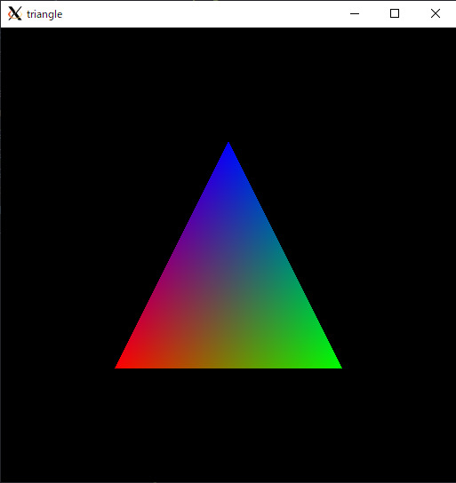
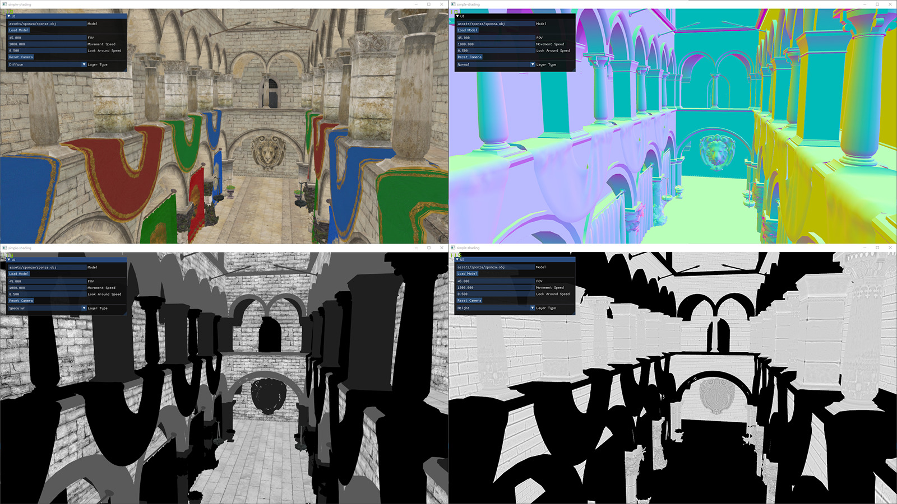
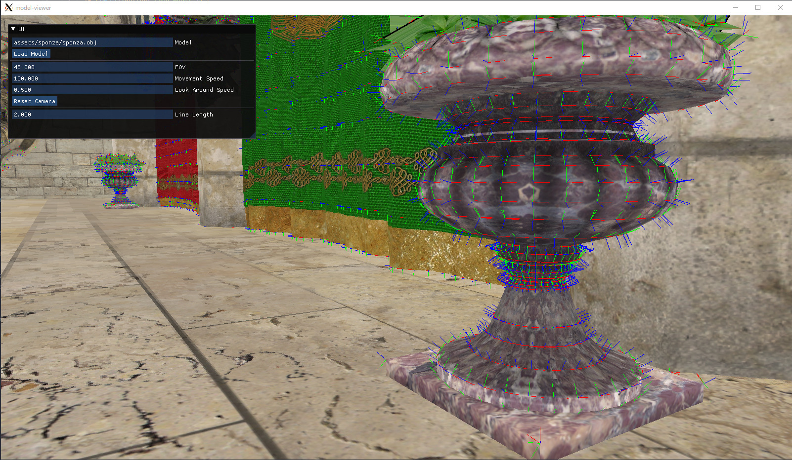
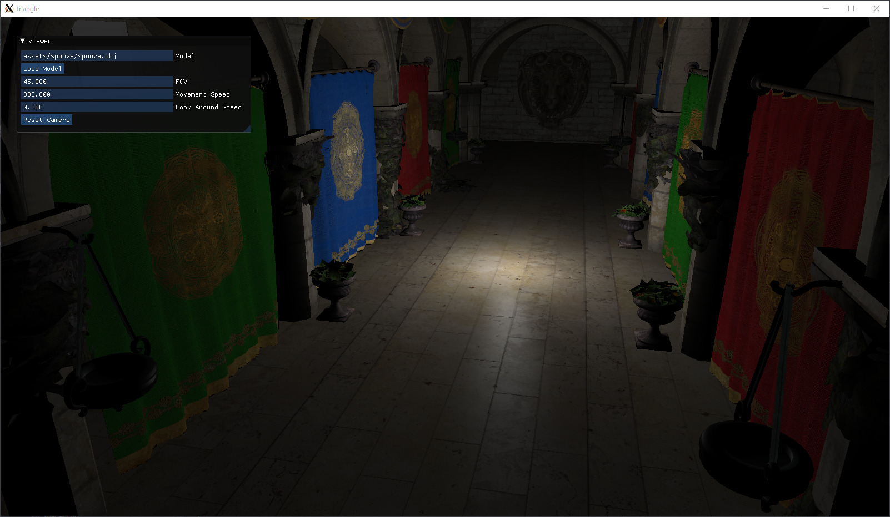
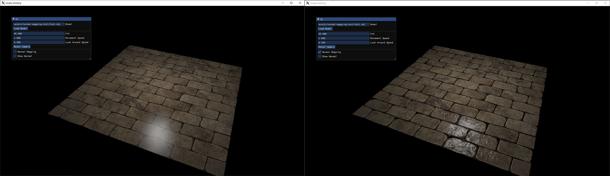
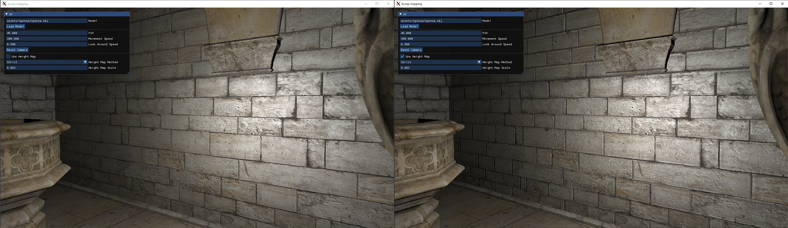
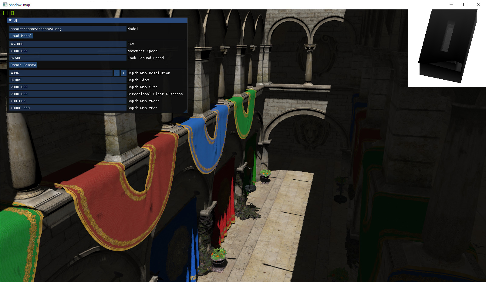
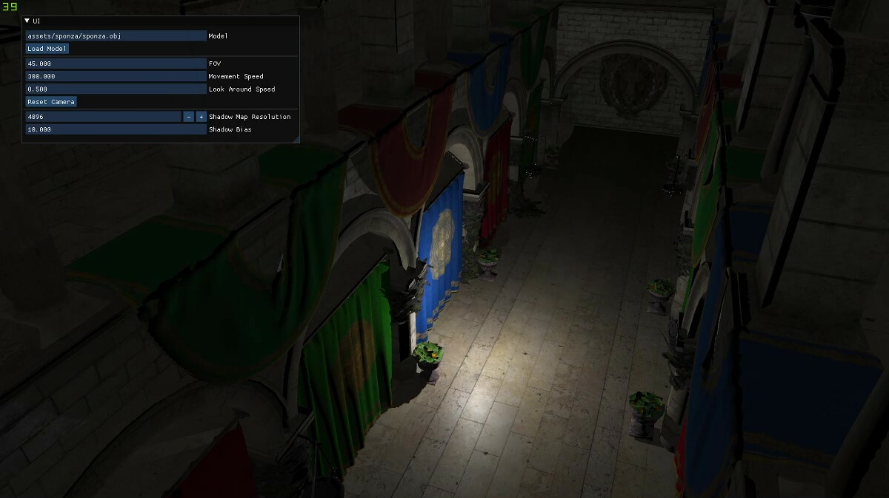

# opengl-sandbox

WIP.

experiment environment for realtime graphics methods in OpenGL.

## Requirements

* C++17
* CMake 3.12 or Higher
* OpenGL 3.3

## Features

* Blinn-Phong Shading
* Normal Mapping
* Shadow Mapping

## Setup

```bash
git submodule update --init
```

## Build

```bash
mkdir build
cd build
cmake ..
make
```

## Gallery

### triangle

Hello world in OpenGL.



### model-viewer

Visualize 3d models with various layers such as Position, Normal, TexCoords, Diffuse, ...



### tangent-space

Visualize basis of tangent space at each vertex using geometry shader.



### simple-shading

Blinn-Phong shading example with moving point light.



### normal-mapping

Normal mapping example with Blinn-Phong shading.



### bump-mapping

Bump mapping example using height map with Blinn-Phong shading.



### shadow-mapping

Shadow mapping example with moving directional light.



### omnidirectional-shadow-mapping

Omnidirectional shadow mapping example with moving point light.



## Externals

* [glad](https://github.com/Dav1dde/glad)
* [glm](https://github.com/g-truc/glm)
* [GLFW](https://github.com/glfw/glfw)
* [assimp](https://github.com/assimp/assimp)
* [imgui](https://github.com/ocornut/imgui)
* [stb](https://github.com/nothings/stb)
* [GLSL Shader Includes](https://github.com/tntmeijs/GLSL-Shader-Includes)

## References

* [Learn OpenGL](https://learnopengl.com/)
* [Project ASURA](http://www.project-asura.com/)